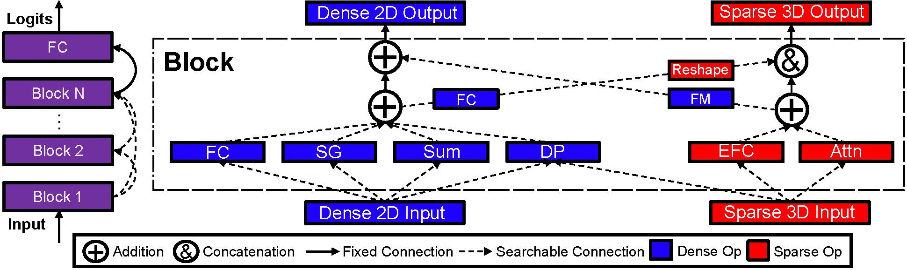

# [WWW'23] NASRec: Weight Sharing Neural Architecture Search for Recommender Systems
This is the official implementation of our work, [**NASRec: Weight Sharing Neural Architecture Search for Recommender Systems.**](https://arxiv.org/abs/2207.07187) This work implements a design automation for Click-Through Rate (CTR) prediction task on Recommender Systems, enabling the design and exploration of CTR models in an automatic fashion. 

## Highlights

* NASRec utilizes a flexbiel search space,  supporting dense connectivity of heterogenous building operators.



* NASRec achieves the state-of-the-art results on 3 CTR applications, with significantly lower model complexity.

| Model | Dataset  | Search Space | Log Loss | AUC | FLOPS(M) | Checkpoint & Logs |
|---|---|---|---|---|---|---|
| NASRecNet  | Criteo  | NASRec-Small | 0.4399 | 0.8118 | 2.20 | [Here](https://www.dropbox.com/s/ytigug9waoaofls/criteo_autoctr_best_1shot_lr0.1_wd0_L0.4395.zip?dl=0) |
| NASRecNet  | Criteo  | NASRec-Full  | 0.4408 | 0.8107 | 1.45 | [Here](https://www.dropbox.com/s/9vi2bq58iymqflr/criteo_xlarge_best_1shot_lr0.16_wd0_L0.4404.zip?dl=0) |
| NASRecNet  | Avazu   | NASRec-Small  | 0.3747 | 0.7887 | 3.08 | [Here](https://www.dropbox.com/s/cofonaa34lgmszb/avazu_autoctr_best_1shot_lr0.1_wd0-L0.3741.zip?dl=0) |
| NASRecNet  | Avazu   | NASRec-Full  | 0.3737 | 0.7903 | 1.87 | [Here](https://www.dropbox.com/s/f68rg0an2l0wmr8/avazu_xlarge_best_1shot_lr0.20_wd0_L0.3736.zip?dl=0) |
| NASRecNet  | KDD-Cup'12   | NASRec-Small  | 0.1495 | 0.8135 | 3.48 | [Here](https://www.dropbox.com/s/dyr0enynx6odz83/kdd_autoctr_best_1shot_lr0.1_wd0_L0.1489.zip?dl=0) |
| NASRecNet  | KDD-Cup'12   | NASRec-Full  | 0.1491 | 0.8154 | 1.09 | [Here](https://www.dropbox.com/s/l69pdqe5w00fu7h/kdd_xlarge_best_1shot_lr0.16_wd0_L0.1487.zip?dl=0) |


## Examples
 QucikStart: Run the best models that we have discovered so far.

**Step 1: Download preprocessed training/validation/testing dataset from the following link:**
You are also able to visit `tools/autoctr_split_data_<dataset>.py` and run the processed script to obtain the dataset from raw [criteo](https://www.kaggle.com/competitions/criteo-display-ad-challenge/data), [avazu](https://www.kaggle.com/competitions/avazu-ctr-prediction/data), or [kdd](https://www.kaggle.com/competitions/kddcup2012-track2). We only use the **"training"** set on kaggle as testing set does not have labels. For example,
```
python nasrec/tools/autoctr_split_data_criteo.py --data_dir <dataset>/train.csv --output_dir ./data/criteo_kaggle
```
Please unzip the data and place them under the folder "./data". (You may need to create one if it does not exist.)

***MD5 Sum Check*** You are encouraged to check the md5sum of the split dataset to verify correctness. 

**Criteo Kaggle**:
```bash
md5sum criteo_kaggle_autoctr/shard-0/*
5d8fea15e6f9c48a0a64b4a5bf971cc4  criteo_kaggle_autoctr/shard-0/test.txt
4b8757a78fdb260f6ae9b72e05dca400  criteo_kaggle_autoctr/shard-0/train.txt
acba0de85545c95a022d7c54aa9e8a8e  criteo_kaggle_autoctr/shard-0/trainval.txt
91b0ff0a10d7a0cd2a6d59da9e5900b9  criteo_kaggle_autoctr/shard-0/val.txt
```
**Avazu Kaggle**:
```bash
md5sum avazu_kaggle_autoctr/shard-0/*
18bf7ba03d014d5661b9d8de1c0cbafe  avazu_kaggle_autoctr/shard-0/test.txt
4cbec9323c975209b64a8403b2151ec7  avazu_kaggle_autoctr/shard-0/train.txt
c47e4cba6b6945507ea754e2cf352578  avazu_kaggle_autoctr/shard-0/trainval.txt
445bc4a44216c15c1b953523e0b0bc35  avazu_kaggle_autoctr/shard-0/val.txt
```
**KDD Kaggle**
```bash
md5sum kdd_kaggle_autoctr/shard-0/*
4cdfb93e36784d8e39ac00ac6e36a727  kdd_kaggle_autoctr/shard-0/test.txt
eec7bb5bec894b42145cc9d0d0d624d0  kdd_kaggle_autoctr/shard-0/train.txt
0d309f16f95bded40456f63735ee6534  kdd_kaggle_autoctr/shard-0/trainval.txt
c44da6a57501b812cc55997893276a66  kdd_kaggle_autoctr/shard-0/val.txt
```

Within each `shard`, you need to do `cat train.txt val.txt >trainval.txt` to obtain the training and validation data after running data split.

**Step 2: Train the best model found on Criteo, under NASRec-Full search space. You should use the following script:**
```bash
LR=0.16
WD=0

python -u nasrec/main_train.py \
    --root_dir ./data/criteo_kaggle_autoctr/ \
    --net supernet-config \
    --supernet_config nasrec/configs/criteo/ea_criteo_kaggle_xlarge_best_1shot.json \
    --num_epochs 1 \
    --learning_rate $LR \
    --train_batch_size 256 \
    --wd $WD \
    --logging_dir ./experiments-www-repro/best_models/criteo_xlarge_best_1shot_lr${LR}_wd${WD} \
    --gpu 0 \
    --test_interval 10000
```
This should give you $\sim$ 0.4408 $\pm$ 0.0002 Log loss on the test split. The latest release can give you 0.4405 or better on PyTorch 2.0+.

You may also find the related scripts on Avazu/KDD Kaggle dataset under the folder `nasrec/scripts/eval_best_model`. For search space specifications, `eval_XXX_autoctr_*` indicates the evaluation on **NASRec-Small** search space, and `eval_XXX_xlarge_*` indicates the evaluation on **NASRec-Full** search space.

**Note: please refer to `nasrec/utils/config.py:L17` to double check the embeddings that you use for final evaluation. You should use the full embedding, instead of capping the embedding table size to 0.5M during search.** 

## Requirements
We export the conda environment of NASRec project in `environment.yml`. You can install all requirements via the following command:

```bash
conda env create -f environment.yml
```

## Full documentation
Below is a brief review of this project:
```
nasrec
│   README.md
│
└───configs
│   SuperNet configurations, including the best models.
│   │   avazu
│   │   criteo   
│   │   kdd   
└───scripts
    │   eval_best_candidate
    │   eval_best_model
    |   run_ea
    |   train_subnet            (Not needed in the flow)
    |   train_supernet          (Supernet training script. Feel free to explore yourself for now!)
```
Most functions of the scripts/modules are suggested by the folder names. We are working on some tutorials to faciliate NASRec, and promote future line of research on recommender systems. Stay tuned!

## Join the NASRec community
See the [CONTRIBUTING](CONTRIBUTING.md) file for how to help out.
## License
NASRec is Apache licensed, as found in the LICENSE file.

## Citation
If you would like to use our work to develop your own research, please use the following citation:

*Biblatex*
``` biblatex
@article{zhang2022nasrec,
  title={NASRec: Weight Sharing Neural Architecture Search for Recommender Systems},
  author={Zhang, Tunhou and Cheng, Dehua and He, Yuchen and Chen, Zhengxing and Dai, Xiaoliang and Xiong, Liang and Yan, Feng and Li, Hai and Chen, Yiran and Wen, Wei},
  journal={arXiv preprint arXiv:2207.07187},
  year={2022}
}
```

*ACM Reference Format*
```
Tunhou Zhang, Dehua Cheng, Yuchen He, Zhengxing Chen, Xiaoliang Dai, Liang Xiong, Feng Yan, Hai Li, Yiran Chen, and Wei Wen. 2023. NASRec: Weight Sharing Neural Architecture Search for Recommender Systems. In Proceedings of the ACM Web Conference 2023 (WWW '23), April 30--May 04, 2023, Austin, TX, USA. ACM, New York, NY, USA 9 Pages. https://doi.org/10.1145/3543507.3583446
```
